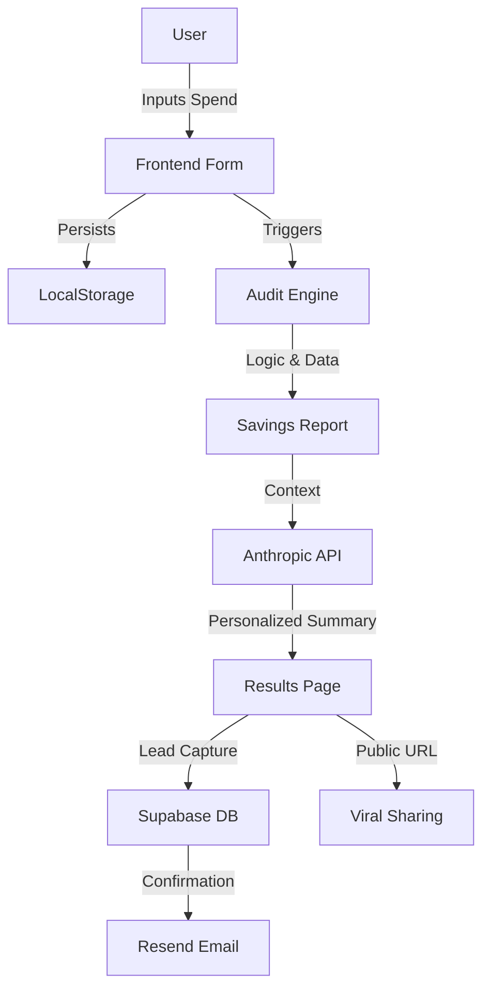

# ARCHITECTURE.md

## System Overview

Lumina AI Audit is built as a modern, high-performance web application designed for viral growth and lead generation.

### Tech Stack
- **Frontend**: Next.js 15 (App Router), TypeScript, Tailwind CSS, shadcn/ui.
- **Animations**: Framer Motion for premium transitions and interactive feel.
- **Backend**: Supabase (PostgreSQL + Auth + Edge Functions).
- **Email**: Resend for transactional audit reports.
- **AI**: Anthropic Claude 3.5 Sonnet for personalized summary generation.

### Data Flow
1. **User Input**: Form data is captured and persisted in `localStorage` for cross-session continuity.
2. **Audit Logic**: A deterministic engine (TypeScript) processes inputs against verified pricing data to calculate savings.
3. **AI Summary**: Input and audit results are sent to a Next.js Server Action which calls the Anthropic API.
4. **Lead Capture**: On user approval, data is sent to Supabase and a unique UUID is generated for the shareable URL.
5. **Notification**: Resend triggers a transactional email to the user with their audit link.

### System Diagram (Mermaid)

### Scalability Considerations
If this tool had to handle 10,000 audits per day:
- **Rate Limiting**: Implement Upstash or similar Redis-based rate limiting on the API summary endpoint.
- **Caching**: Cache common stack results to reduce LLM calls for identical inputs.
- **Edge Functions**: Move audit logic to Edge Functions to reduce latency for global users.
- **Static Export**: The results page for existing audits should be statically generated or ISR-based to handle high traffic surges from social media shares.
